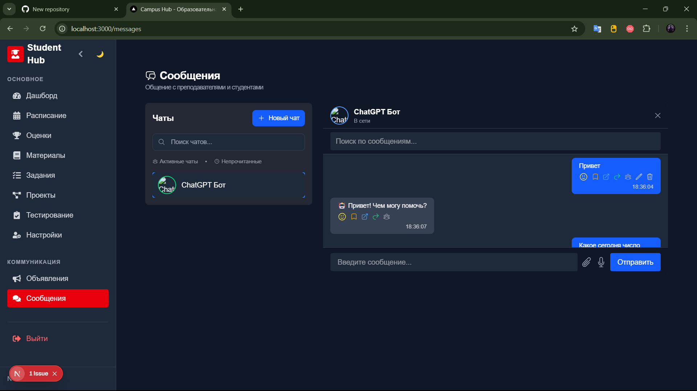
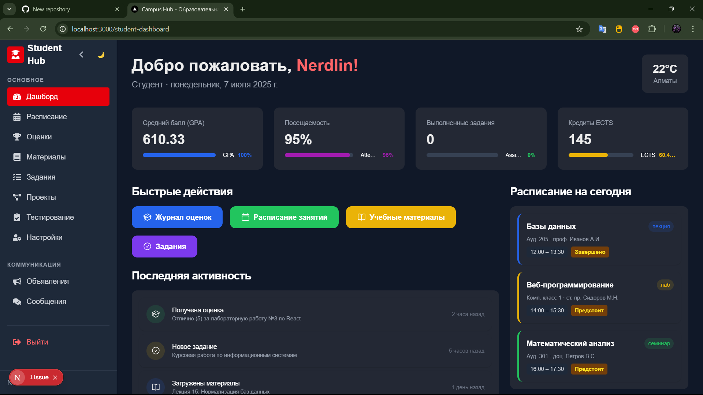
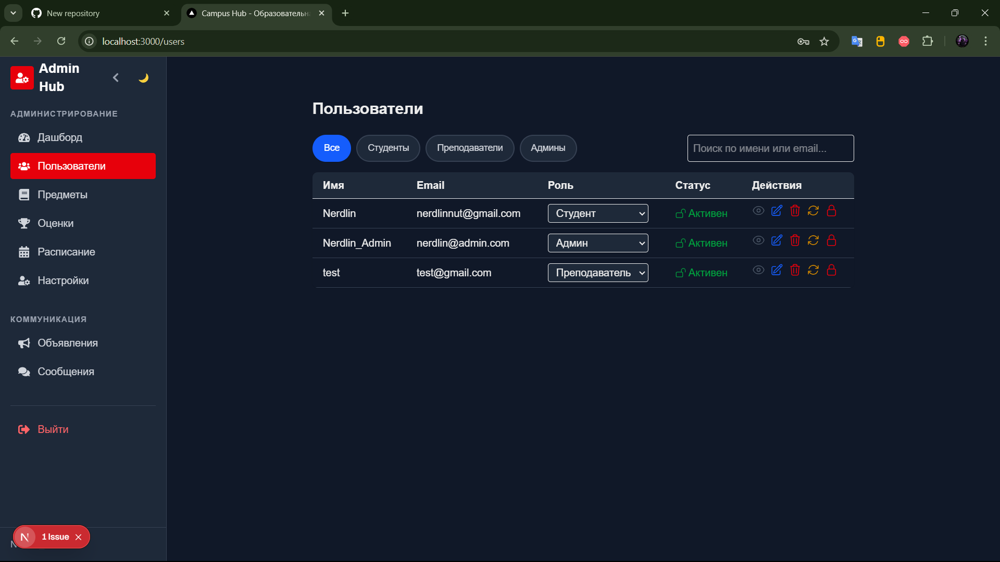

# Campus Hub — Современная образовательная платформа


## О проекте
**Campus Hub** — это современная образовательная платформа для студентов, преподавателей и администраторов. Проект реализован на Next.js/React с поддержкой реальных API, продвинутого чата с AI-ботом, глобальной темой, ролевым доступом и интеграцией с внешними сервисами (погода, новости, курсы валют и др.).

---

## Основные возможности
- 📚 **Дашборды** для студентов, преподавателей и админов
- 💬 **Чат** с реальными пользователями и AI-ботом (ChatGPT)
- 🔔 **Push-уведомления** и real-time обновления (WebSocket)
- 👤 **Управление пользователями** (поиск, фильтры, CRUD, смена ролей, блокировка)
- 🗂️ **Управление предметами, оценками, расписанием**
- 🌗 **Глобальная поддержка светлой/тёмной темы**
- 🔒 **Ролевой доступ** (студент, преподаватель, админ)
- 🔑 **Восстановление и смена пароля**
- 📎 **Вложения и поиск по сообщениям**
- 🤖 **AI-бот с интеграцией OpenAI** (контекстные ответы, поддержка истории)
- 🌦️ **Погода, новости, курсы валют, транспорт, кино, расписание звонков**

---

## Скриншоты
- 
- 
- 

---

## Быстрый старт

1. **Клонируйте репозиторий:**
   ```bash
   git clone ...
   cd campus-hub
   ```
2. **Установите зависимости:**
   ```bash
   npm install
   ```
3. **Создайте файл `.env.local` и добавьте ключи:**
   ```env
   OPENAI_API_KEY=sk-...
   OPENWEATHER_API_KEY=...
   NEWSAPI_KEY=...
   ```
   > Для получения ключей смотрите раздел "Интеграция с сервисами" ниже.
4. **Запустите проект:**
   ```bash
   npm run dev
   ```
5. **Откройте в браузере:**
   [http://localhost:3000](http://localhost:3000)

---

## Интеграция с сервисами
- **OpenAI** — для AI-бота (https://platform.openai.com/)
- **OpenWeatherMap** — погода (https://openweathermap.org/)
- **NewsAPI** — новости (https://newsapi.org/)
- **ExchangeRate.host** — курсы валют (https://exchangerate.host/)
- **Транспорт, кино, звонки** — демонстрационные ответы (можно подключить реальные API)

---

## Примеры запросов для AI-бота
- "Какая погода в Париже?"
- "Свежие новости в США"
- "Курс доллара к евро"
- "Когда следующий автобус 12 в Москве?"
- "Какие фильмы идут сегодня в Алматы?"
- "Расписание звонков в школе №5"

---

## Структура проекта
- `src/pages` — страницы Next.js
- `src/components` — UI-компоненты
- `src/api` — API-клиенты
- `src/pages/api/gpt.ts` — интеграция с OpenAI и внешними сервисами
- `public/` — статика и иконки

---

## Контакты и поддержка
- [Telegram](https://t.me/nerdlin
- [Email](nerdlinnut@gmail.com)

---

**Campus Hub — современное образование для всех!**
