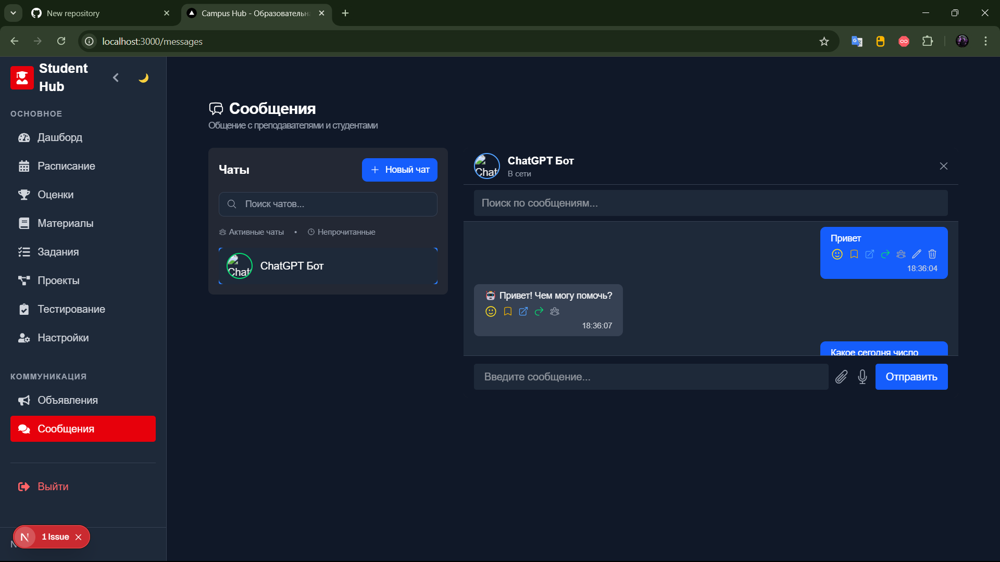
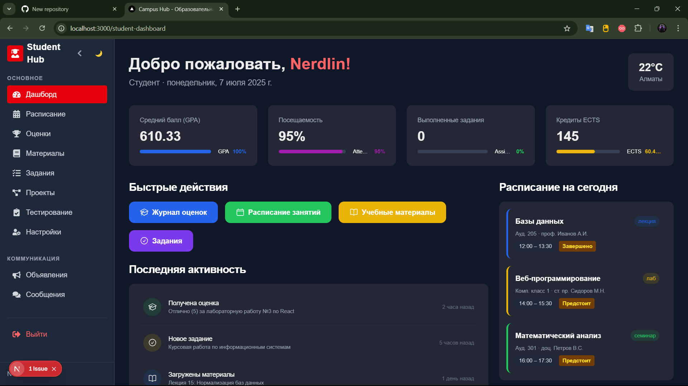
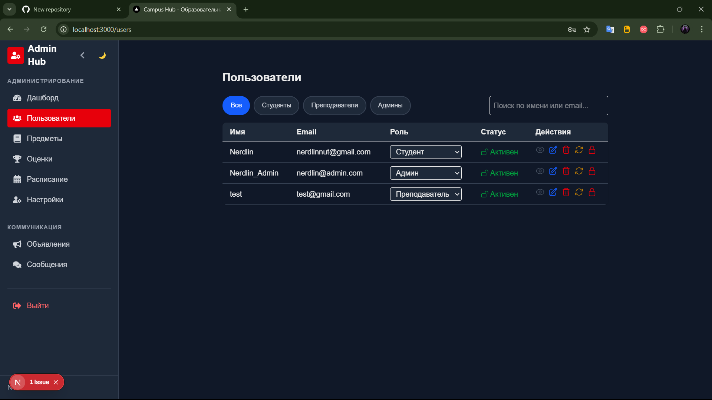

# Campus Hub

Modern educational platform built with Next.js and React.

Live page: [https://nerdlin.github.io/Campus_Hub/](https://nerdlin.github.io/Campus_Hub/)

## What the Project Includes
- Student, teacher, and admin dashboards
- Messaging and chat flows
- Grade and schedule management
- Profile/settings pages
- AI assistant API route (`/api/gpt`)
- Light/dark UI support

## Runtime Modes
Campus Hub supports 3 practical modes:

1. Local full-stack mode
Run Next.js + local API server (`server.js`) for full CRUD/auth flows.

2. GitHub Pages demo mode
When deployed to Pages without `NEXT_PUBLIC_API_URL`, frontend automatically uses browser-local demo storage (no backend required).

3. Production API mode (Render/VPS/etc.)
Set `NEXT_PUBLIC_API_URL=https://<your-api>/api` and use real backend endpoints.

## Quick Start (Local)
```bash
npm install
npm run dev
```

By default:
- App: `http://localhost:3000`
- Local API server: `http://localhost:4000`

## Environment Variables
Create `.env.local` and set what you need:

```env
# Frontend/API
NEXT_PUBLIC_API_URL=http://localhost:4000/api
NEXT_PUBLIC_BASE_PATH=/Campus_Hub
NEXT_PUBLIC_GITHUB_PAGES=false

# Integrations
OPENAI_API_KEY=
OPENWEATHER_API_KEY=
NEWSAPI_KEY=

# Local API server
PORT=4000
CORS_ORIGIN=*
MAX_UPLOAD_SIZE_MB=10
```

### GitHub Pages Note
If `NEXT_PUBLIC_API_URL` is empty on Pages build, app falls back to demo mode intentionally.

## Demo Accounts (Pages demo mode)
- `admin@campushub.local` / `admin123`
- `teacher@campushub.local` / `teacher123`
- `student@campushub.local` / `student123`

## Scripts
| Script | Description |
|---|---|
| `npm run dev` | Run Next.js + local API server |
| `npm run server` | Run only local API server |
| `npm run build` | Production build |
| `npm run start` | Start built app |
| `npm run lint` | Lint checks |

## Render Setup (Production API)
If you want real backend instead of demo mode:

1. Deploy backend service (Node) using this repo (or a backend-only copy).
2. Ensure service exposes API routes (for example `/api/login`, `/api/register`, etc.).
3. In GitHub Actions Pages workflow, set:
   - `NEXT_PUBLIC_API_URL=https://<your-render-domain>/api`
4. Redeploy Pages.

After this, frontend sends real requests and does not use demo storage.

## Why You May See 405 on Pages
`405 Method Not Allowed` happens when frontend sends `POST /login` to static Pages host (no backend route there).

Current README setup avoids this by defaulting to demo mode when no API URL is configured.

## Project Structure (Simplified)
```text
Campus_Hub/
  src/
    app/                  # App Router pages
    components/           # UI and feature components
    hooks/                # Shared hooks
    lib/
      api.ts              # Main API layer + demo fallback
      i18n.ts             # i18n bootstrap
    api/                  # Legacy wrappers used by some pages
  server.js               # Local API server for development
  db.json                 # Local data source for json-server
  .github/workflows/
    deploy-pages.yml      # GitHub Pages deploy
    ci.yml                # CI checks
```

## Screenshots




## License
MIT
